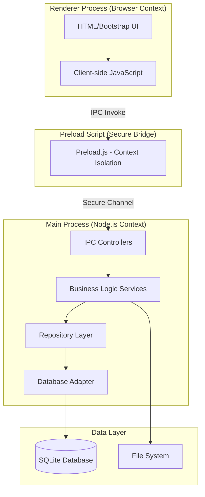
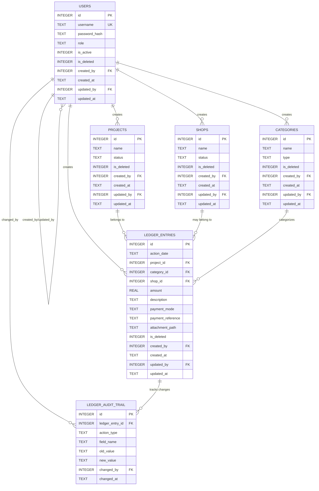
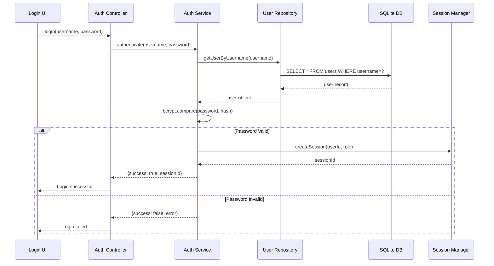
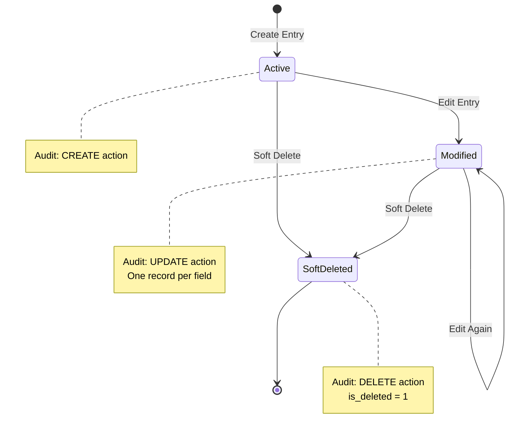
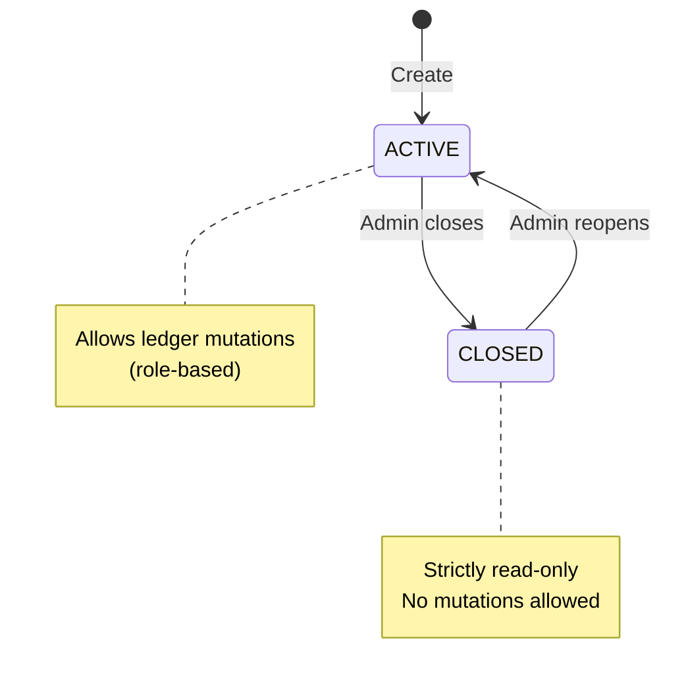
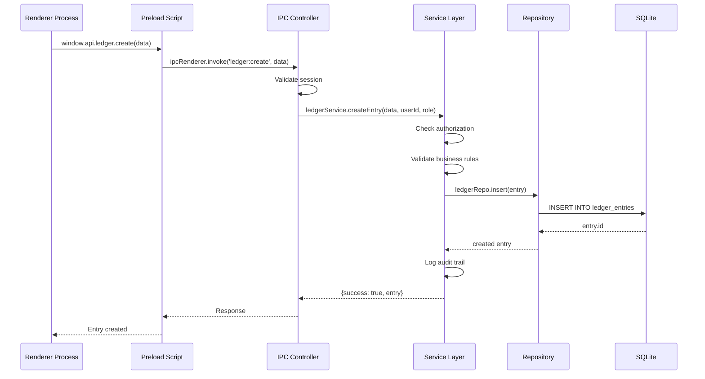
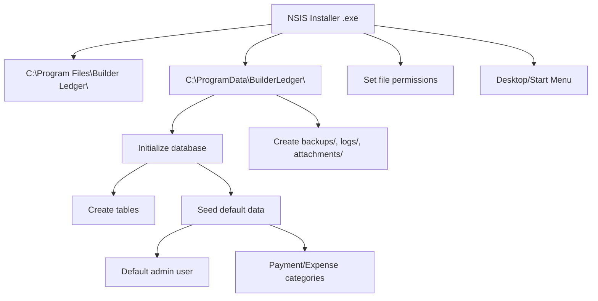

# Builder Ledger - High-Level Design (HLD)

## Document Information
- **Version**: 1.1
- **Last Updated**: 2026-01-15
- **Status**: Production-Ready
- **Purpose**: System architecture and design overview for Builder Ledger

---

## 1. System Overview

### 1.1 Purpose
Builder Ledger is an **offline-first desktop application** designed to digitize construction project financial management for builders, replacing traditional manual ledger notebooks.

### 1.2 Key Characteristics
- **Deployment**: Windows desktop application (Electron-based)
- **Data Storage**: Local SQLite database with shared multi-user access
- **Network**: 100% offline at runtime (internet allowed during development only)
- **User Model**: Role-based access (ADMIN, ACCOUNTANT, REPORT_VIEWER)
- **Security**: Local authentication, in-memory sessions, bcrypt hashing
- **Audit**: Field-level change tracking for ledger entries only

---

## 2. Architecture Overview

### 2.1 Layered Architecture



### 2.2 Layer Responsibilities

| Layer | Responsibility | Technology |
|-------|----------------|------------|
| **UI Layer** | User interaction, form validation, display | HTML, Bootstrap 5.3 (local), Vanilla JS |
| **IPC Layer** | Request routing, response formatting | Electron IPC |
| **Service Layer** | Business logic, authorization, validation | Node.js |
| **Repository Layer** | Data access, SQL queries | Node.js + SQLite3 |
| **Data Layer** | Database abstraction, transactions | SQLite with WAL mode |

---

## 3. Data Architecture

### 3.1 Entity Relationship Diagram



### 3.2 Database Design Principles

1. **Single Source of Truth**: One `ledger_entries` table for all transactions
2. **Soft Delete**: All tables use `is_deleted` flag (no physical deletes)
3. **Audit Trail**: Immutable `ledger_audit_trail` for ledger entries only
4. **Foreign Keys**: Enforced with `PRAGMA foreign_keys = ON`
5. **WAL Mode**: Write-Ahead Logging for concurrent read/write
6. **Derived Balances**: All balances calculated, never stored

### 3.3 Data Storage Locations

**Windows Installation Paths**:

```
C:\Program Files\Builder Ledger\          # Application binaries
├── builder-ledger.exe
├── resources\
└── ...

C:\ProgramData\BuilderLedger\             # Shared application data
├── data\
│   └── builder-ledger.db                 # SQLite database
├── backups\
│   ├── builder-ledger_2026-01-15.db
│   └── ...
├── logs\
│   ├── app_2026-01-15.log
│   └── ...
└── attachments\
    └── {year}\{month}\{ledger_entry_id}\
```

---

## 4. Security Architecture

### 4.1 Authentication Flow



### 4.2 Security Measures

| Component | Security Measure | Implementation |
|-----------|------------------|----------------|
| **Passwords** | Bcrypt hashing (cost 10) | Never store plaintext |
| **Sessions** | In-memory only | Cleared on app restart, NO sessionStorage |
| **Electron** | Context isolation | `contextIsolation=true` |
| **Electron** | Node integration disabled | `nodeIntegration=false` |
| **Database** | Parameterized queries | Prevent SQL injection |
| **Authorization** | Service-layer enforcement | UI is defensive only |
| **Audit Trail** | Immutable logs | Track ledger changes |

### 4.3 Authorization Model

**Role-Based Access Control**:

| Role | Permissions |
|------|-------------|
| **ADMIN** | User/project/shop/category management, lifecycle control, read-only ledger, backup management |
| **ACCOUNTANT** | Ledger CRUD (ACTIVE projects/shops only), payments, refunds |
| **REPORT_VIEWER** | Read-only access to all data |

**Enforcement**: Authorization checks in service layer only (NOT in UI or controllers)

---

## 5. Business Logic Architecture

### 5.1 Ledger Entry Lifecycle



### 5.2 Project/Shop Lifecycle



### 5.3 Payment Category Rules

| Category | Type | Shop Constraint | Validation |
|----------|------|-----------------|------------|
| **Payment Received** | Money IN | Shop MUST be NULL | Customer to Builder |
| **Shop Payment** | Money OUT | Shop REQUIRED | Shop ACTIVE, payment details required |
| **Refund to Customer** | Money OUT | Shop MUST be NULL | Project ACTIVE, balance > 0 |
| **Expense Categories** | Money OUT | Shop OPTIONAL | Cement, Steel, Labor, etc. |

---

## 6. Timestamp Architecture

### 6.1 IST Timezone Standard

**Critical Rule**: All timestamps generated by **application layer ONLY**

- **Timezone**: Asia/Kolkata (IST)
- **Format**: ISO-8601 with timezone offset
- **NO database-generated timestamps**
- **NO triggers**

**Applies to**:
- `action_date`
- `created_at`
- `updated_at`
- `changed_at`

**Implementation**: Application layer generates timestamps using IST timezone before inserting into database.

---

## 7. Integration Architecture

### 7.1 IPC Communication Pattern



### 7.2 File System Integration

**Attachment Storage**:
- **Upload**: Validate format (JPG/PNG/PDF), size (5MB max), count (5 max)
- **Storage**: `C:\ProgramData\BuilderLedger\attachments\{year}\{month}\{entry_id}\`
- **Database**: Store relative paths only (comma-separated)
- **Immutable**: No deletion on ledger soft delete

**Backup System**:
- **Auto Weekly**: On startup if last backup > 7 days, retain 8 backups
- **On-Demand**: ADMIN-triggered, user selects folder
- **Process**: Close DB → Copy file → Reopen DB

**Logging**:
- **File**: Daily rotation, 30-day retention
- **Location**: `C:\ProgramData\BuilderLedger\logs\`
- **Levels**: INFO, WARN, ERROR
- **Content**: No sensitive data

---

## 8. Deployment Architecture

### 8.1 Installation Model



### 8.2 Multi-User Access Model

**Shared Database**:
- Single SQLite file shared by all Windows users
- WAL mode enables concurrent read/write
- File permissions allow read/write for all users

**User Isolation**:
- Authentication required per user
- Role-based authorization enforced
- Audit trail tracks user actions

---

## 9. Performance Considerations

### 9.1 Database Optimization

**Indexes** (conceptual):
- `ledger_entries(project_id, action_date)`
- `ledger_entries(category_id)`
- `ledger_entries(shop_id)`
- `ledger_entries(is_deleted)`
- `ledger_audit_trail(ledger_entry_id)`

**Query Patterns**:
- Always filter by `is_deleted = 0`
- Use date ranges on `action_date`
- Leverage composite indexes

### 9.2 Performance Targets

| Operation | Target |
|-----------|--------|
| App Startup | < 3 seconds |
| Login | < 500ms |
| Ledger Query | < 500ms (10,000 entries) |
| Entry Create | < 200ms |
| Backup | < 5 seconds (100MB DB) |

---

## 10. Technology Stack

| Component | Technology | Version | Justification |
|-----------|------------|---------|---------------|
| **Runtime** | Electron | 28.x | Cross-platform desktop |
| **Database** | SQLite | 3.x | Embedded, zero-config |
| **UI** | Bootstrap | 5.3 (local) | Responsive, offline |
| **Auth** | bcrypt | 5.x | Password hashing |
| **Logging** | Winston | 3.x | Production logging |
| **Packaging** | electron-builder | 24.x | NSIS installer |

---

## 11. Non-Functional Requirements

### 11.1 Security
- ✅ No plaintext passwords
- ✅ Context isolation prevents renderer Node.js access
- ✅ Parameterized queries prevent SQL injection
- ✅ Audit trail for compliance
- ✅ No sessionStorage usage

### 11.2 Reliability
- ✅ Automatic weekly backups
- ✅ Soft delete prevents data loss
- ✅ WAL mode prevents corruption
- ✅ Comprehensive logging

### 11.3 Offline Operation
- ✅ No internet required at runtime
- ✅ All assets local (Bootstrap, fonts)
- ✅ No CDN dependencies
- ✅ Internet allowed during development only

### 11.4 Maintainability
- ✅ Layered architecture
- ✅ Repository pattern enables DB migration
- ✅ IST timestamps in application layer

---

## 12. Assumptions & Constraints

### 12.1 Assumptions
- Users have basic computer literacy
- Windows 10/11 x64 with admin rights for installation
- Single machine deployment
- Maximum 10 concurrent users

### 12.2 Constraints
- **No Internet at Runtime**: Application must work offline
- **Windows Only**: V1 targets Windows 10/11 x64
- **No Cloud**: All data stored locally
- **No Mobile**: Desktop-only (V1)
- **No sessionStorage**: Sessions in memory only

---

**Document Status**: ✅ Production-Ready  
**Approved By**: [Pending]  
**Date**: 2026-01-15
