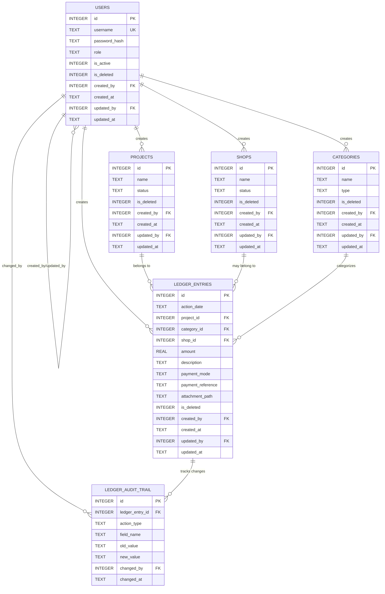

# Builder Ledger - Database Design

## Document Information
- **Version**: 1.1
- **Last Updated**: 2026-01-15
- **Status**: Production-Ready
- **Purpose**: Database design and entity relationships (design-level, no SQL scripts)

---

## 1. Database Overview

### 1.1 Database Technology
- **Engine**: SQLite 3.x
- **File**: Single `.db` file
- **Location**: `C:\ProgramData\BuilderLedger\data\builder-ledger.db`
- **Mode**: WAL (Write-Ahead Logging)
- **Foreign Keys**: Enforced

### 1.2 Design Principles
- **Single Source of Truth**: One `ledger_entries` table for all transactions
- **Soft Delete**: All tables use `is_deleted` flag
- **Audit Trail**: Immutable `ledger_audit_trail` for ledger entries only
- **Derived Balances**: All balances calculated, never stored
- **IST Timestamps**: Generated by application layer only

---

## 2. Entity Relationship Diagram



---

## 3. Table Definitions

### 3.1 users

**Purpose**: Store user accounts with role-based access

| Column | Type | Constraints | Description |
|--------|------|-------------|-------------|
| id | INTEGER | PRIMARY KEY AUTOINCREMENT | Unique user ID |
| username | TEXT | NOT NULL, UNIQUE | Login username |
| password_hash | TEXT | NOT NULL | Bcrypt hashed password |
| role | TEXT | NOT NULL | ADMIN / ACCOUNTANT / REPORT_VIEWER |
| is_active | INTEGER | NOT NULL, DEFAULT 1 | 1=active, 0=inactive |
| is_deleted | INTEGER | NOT NULL, DEFAULT 0 | Soft delete flag |
| created_by | INTEGER | FK → users(id) | User who created this record |
| created_at | TEXT | NOT NULL | IST timestamp (ISO-8601) |
| updated_by | INTEGER | FK → users(id) | User who last updated |
| updated_at | TEXT | NOT NULL | IST timestamp (ISO-8601) |

**Indexes**:
- PRIMARY KEY on `id`
- UNIQUE on `username`

**Business Rules**:
- Username must be unique
- Password must be bcrypt hashed (never plaintext)
- Role must be one of: ADMIN, ACCOUNTANT, REPORT_VIEWER
- Soft delete only (is_deleted = 1)

---

### 3.2 projects

**Purpose**: Store construction projects

| Column | Type | Constraints | Description |
|--------|------|-------------|-------------|
| id | INTEGER | PRIMARY KEY AUTOINCREMENT | Unique project ID |
| name | TEXT | NOT NULL | Project name |
| status | TEXT | NOT NULL, DEFAULT 'ACTIVE' | ACTIVE / CLOSED |
| is_deleted | INTEGER | NOT NULL, DEFAULT 0 | Soft delete flag |
| created_by | INTEGER | FK → users(id) | User who created |
| created_at | TEXT | NOT NULL | IST timestamp |
| updated_by | INTEGER | FK → users(id) | User who last updated |
| updated_at | TEXT | NOT NULL | IST timestamp |

**Indexes**:
- PRIMARY KEY on `id`
- Index on `status`
- Index on `is_deleted`

**Business Rules**:
- Status can be ACTIVE or CLOSED
- Only ADMIN can change status
- CLOSED projects are read-only
- Soft delete only

---

### 3.3 shops

**Purpose**: Store vendors/suppliers

| Column | Type | Constraints | Description |
|--------|------|-------------|-------------|
| id | INTEGER | PRIMARY KEY AUTOINCREMENT | Unique shop ID |
| name | TEXT | NOT NULL | Shop name |
| status | TEXT | NOT NULL, DEFAULT 'ACTIVE' | ACTIVE / CLOSED |
| is_deleted | INTEGER | NOT NULL, DEFAULT 0 | Soft delete flag |
| created_by | INTEGER | FK → users(id) | User who created |
| created_at | TEXT | NOT NULL | IST timestamp |
| updated_by | INTEGER | FK → users(id) | User who last updated |
| updated_at | TEXT | NOT NULL | IST timestamp |

**Indexes**:
- PRIMARY KEY on `id`
- Index on `status`
- Index on `is_deleted`

**Business Rules**:
- Status can be ACTIVE or CLOSED
- Only ADMIN can change status
- CLOSED shops are read-only
- Soft delete only

---

### 3.4 categories

**Purpose**: Store ledger entry categories (payment and expense)

| Column | Type | Constraints | Description |
|--------|------|-------------|-------------|
| id | INTEGER | PRIMARY KEY AUTOINCREMENT | Unique category ID |
| name | TEXT | NOT NULL | Category name |
| type | TEXT | NOT NULL | PAYMENT / EXPENSE |
| is_deleted | INTEGER | NOT NULL, DEFAULT 0 | Soft delete flag |
| created_by | INTEGER | FK → users(id) | User who created |
| created_at | TEXT | NOT NULL | IST timestamp |
| updated_by | INTEGER | FK → users(id) | User who last updated |
| updated_at | TEXT | NOT NULL | IST timestamp |

**Indexes**:
- PRIMARY KEY on `id`
- Index on `type`
- Index on `is_deleted`

**Business Rules**:
- Type must be PAYMENT or EXPENSE
- Default payment categories: Payment Received, Shop Payment, Refund to Customer
- Default expense categories: Cement, Steel, Labor, etc.
- Soft delete only

---

### 3.5 ledger_entries

**Purpose**: Store all financial transactions

| Column | Type | Constraints | Description |
|--------|------|-------------|-------------|
| id | INTEGER | PRIMARY KEY AUTOINCREMENT | Unique entry ID |
| action_date | TEXT | NOT NULL | Business date (IST) |
| project_id | INTEGER | NOT NULL, FK → projects(id) | Project reference |
| category_id | INTEGER | NOT NULL, FK → categories(id) | Category reference |
| shop_id | INTEGER | NULLABLE, FK → shops(id) | Shop reference (optional) |
| amount | REAL | NOT NULL | Transaction amount |
| description | TEXT | NULLABLE | Entry description |
| payment_mode | TEXT | NULLABLE | Cash/Cheque/Bank Transfer/UPI/Card |
| payment_reference | TEXT | NULLABLE | Cheque no./Transaction ID |
| attachment_path | TEXT | NULLABLE | Comma-separated relative paths |
| is_deleted | INTEGER | NOT NULL, DEFAULT 0 | Soft delete flag |
| created_by | INTEGER | FK → users(id) | User who created |
| created_at | TEXT | NOT NULL | IST timestamp |
| updated_by | INTEGER | FK → users(id) | User who last updated |
| updated_at | TEXT | NOT NULL | IST timestamp |

**Indexes**:
- PRIMARY KEY on `id`
- Composite index on `(project_id, action_date)`
- Index on `category_id`
- Index on `shop_id`
- Index on `is_deleted`

**Business Rules**:
- Every entry MUST belong to a project
- Shop is OPTIONAL for expenses
- Shop MUST be NULL for: Payment Received, Refund to Customer
- Shop MUST NOT be NULL for: Shop Payment
- Amount must be positive
- Soft delete only
- All timestamps generated by application layer (IST)

---

### 3.6 ledger_audit_trail

**Purpose**: Track field-level changes to ledger entries

| Column | Type | Constraints | Description |
|--------|------|-------------|-------------|
| id | INTEGER | PRIMARY KEY AUTOINCREMENT | Unique audit record ID |
| ledger_entry_id | INTEGER | NOT NULL, FK → ledger_entries(id) | Entry being audited |
| action_type | TEXT | NOT NULL | CREATE / UPDATE / DELETE |
| field_name | TEXT | NULLABLE | Field that changed (NULL for CREATE/DELETE) |
| old_value | TEXT | NULLABLE | Previous value (NULL for CREATE) |
| new_value | TEXT | NULLABLE | New value (NULL for DELETE) |
| changed_by | INTEGER | FK → users(id) | User who made the change |
| changed_at | TEXT | NOT NULL | IST timestamp |

**Indexes**:
- PRIMARY KEY on `id`
- Index on `ledger_entry_id`
- Index on `changed_at`

**Business Rules**:
- Audit ONLY for ledger_entries (not for other tables)
- CREATE: Single record with action_type='CREATE'
- UPDATE: One record per changed field with action_type='UPDATE'
- DELETE: Single record with action_type='DELETE' (soft delete)
- Immutable: No updates or deletes allowed
- All timestamps generated by application layer (IST)

---

## 4. Foreign Key Relationships

### 4.1 Self-Referencing

**users**:
- `created_by` → `users(id)`
- `updated_by` → `users(id)`

### 4.2 User References

All tables reference `users(id)` for:
- `created_by`
- `updated_by`

### 4.3 Ledger Entry References

**ledger_entries**:
- `project_id` → `projects(id)` (NOT NULL)
- `category_id` → `categories(id)` (NOT NULL)
- `shop_id` → `shops(id)` (NULLABLE)
- `created_by` → `users(id)`
- `updated_by` → `users(id)`

### 4.4 Audit Trail References

**ledger_audit_trail**:
- `ledger_entry_id` → `ledger_entries(id)`
- `changed_by` → `users(id)`

---

## 5. Index Strategy

### 5.1 Performance Indexes

**Purpose**: Optimize common query patterns

| Table | Index | Purpose |
|-------|-------|---------|
| users | username | Login queries |
| projects | status | Filter by ACTIVE/CLOSED |
| projects | is_deleted | Exclude soft-deleted |
| shops | status | Filter by ACTIVE/CLOSED |
| shops | is_deleted | Exclude soft-deleted |
| categories | type | Filter by PAYMENT/EXPENSE |
| categories | is_deleted | Exclude soft-deleted |
| ledger_entries | (project_id, action_date) | Project ledger queries with date range |
| ledger_entries | (shop_id, action_date) | Shop ledger queries with date range |
| ledger_entries | category_id | Category filtering |
| ledger_entries | is_deleted | Exclude soft-deleted |
| ledger_audit_trail | ledger_entry_id | Audit trail lookup |
| ledger_audit_trail | changed_at | Date range queries |

---

## 6. Data Integrity Constraints

### 6.1 Primary Keys
- All tables have `INTEGER PRIMARY KEY AUTOINCREMENT`

### 6.2 Foreign Keys
- Enforced with `PRAGMA foreign_keys = ON`
- No cascade deletes (soft delete pattern)

### 6.3 Unique Constraints
- `users.username` must be unique

### 6.4 NOT NULL Constraints
- All mandatory fields enforced at database level
- Nullable fields: `shop_id`, `description`, `payment_mode`, `payment_reference`, `attachment_path`, `field_name`, `old_value`, `new_value`

---

## 7. Soft Delete Pattern

### 7.1 Implementation
- All tables have `is_deleted INTEGER NOT NULL DEFAULT 0`
- 0 = Active record
- 1 = Soft deleted record

### 7.2 Query Pattern
- Always filter by `is_deleted = 0` to exclude deleted records
- Soft-deleted records remain in database for audit purposes

---

## 8. Timestamp Management

### 8.1 IST Timezone Standard

**Critical Rule**: All timestamps generated by **application layer ONLY**

- **Timezone**: Asia/Kolkata (IST)
- **Format**: ISO-8601 with timezone offset (e.g., `2026-01-15T17:30:00+05:30`)
- **NO database-generated timestamps**
- **NO DEFAULT (datetime('now'))** in schema
- **NO triggers**

### 8.2 Timestamp Fields

**All tables**:
- `created_at`: Set once on INSERT (application-generated IST)
- `updated_at`: Updated on every UPDATE (application-generated IST)

**ledger_entries**:
- `action_date`: Business date (application-generated IST)

**ledger_audit_trail**:
- `changed_at`: Audit timestamp (application-generated IST)

---

## 9. Seed Data

### 9.1 Default Admin User

**Purpose**: Bootstrap application with initial admin account

- Username: `admin`
- Password: `admin123` (bcrypt hashed)
- Role: `ADMIN`
- Status: Active
- Created by: Self-reference

### 9.2 Default Categories

**Payment Categories**:
- Payment Received (type: PAYMENT)
- Shop Payment (type: PAYMENT)
- Refund to Customer (type: PAYMENT)

**Expense Categories**:
- Cement (type: EXPENSE)
- Steel (type: EXPENSE)
- Labor (type: EXPENSE)
- Bricks (type: EXPENSE)
- Sand (type: EXPENSE)
- Aggregates (type: EXPENSE)
- Electrical (type: EXPENSE)
- Plumbing (type: EXPENSE)
- Miscellaneous (type: EXPENSE)

---

## 10. Common Query Patterns

### 10.1 Project Balance Calculation

**Purpose**: Calculate current balance for a project (derived, not stored)

**Logic**:
```
Balance = SUM(Payment Received) - SUM(Expenses) - SUM(Refunds)
```

**Filters**:
- `project_id = ?`
- `is_deleted = 0`
- Optional: `action_date BETWEEN ? AND ?`

---

### 10.2 Shop Outstanding Payable

**Purpose**: Calculate amount owed to a shop (derived, not stored)

**Logic**:
```
Outstanding = SUM(Purchases) - SUM(Shop Payments)
```

**Filters**:
- `shop_id = ?`
- `is_deleted = 0`
- Category type: EXPENSE for purchases, PAYMENT for shop payments

---

### 10.3 Audit Trail Retrieval

**Purpose**: Get field-level change history for a ledger entry

**Filters**:
- `ledger_entry_id = ?`
- Order by `changed_at DESC`

---

## 11. Database Maintenance

### 11.1 WAL Mode

**Purpose**: Enable concurrent read/write access

**Configuration**: Set on database initialization

**Benefits**:
- Multiple readers can access while one writer is active
- Better performance for multi-user scenarios

### 11.2 Vacuum

**Purpose**: Reclaim space from soft-deleted records

**Frequency**: Manual (as needed)

**Note**: Soft-deleted records are retained for audit purposes

### 11.3 Analyze

**Purpose**: Update query planner statistics

**Frequency**: After significant data changes

---

## 12. Security Considerations

### 12.1 Password Storage
- Never store plaintext passwords
- Use bcrypt with cost factor 10
- Never log or expose `password_hash` column

### 12.2 SQL Injection Prevention
- Use parameterized queries only
- Never concatenate user input into SQL

### 12.3 Audit Trail Integrity
- `ledger_audit_trail` is insert-only (immutable)
- No updates or deletes allowed
- Tracks all changes to ledger entries

---

## 13. Backup Strategy

### 13.1 File-Level Backup

**Source**: `C:\ProgramData\BuilderLedger\data\builder-ledger.db`

**Destination**: `C:\ProgramData\BuilderLedger\backups\builder-ledger_{timestamp}.db`

**Frequency**:
- Auto: Weekly (on startup if > 7 days)
- On-demand: ADMIN-triggered

**Retention**: Last 8 backups

**Process**:
1. Close database connection
2. Copy file
3. Reopen database connection

---

**Document Status**: ✅ Production-Ready  
**Approved By**: [Pending]  
**Date**: 2026-01-15
